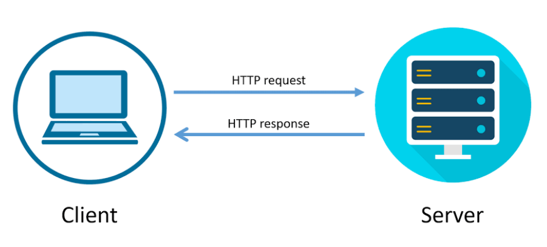

# Request/Response Cycle
## Learning Objectives
* Explain the request/response cycle and the role of clients and servers
* Use Chrome Developer Tools to identify requests and responses made from a web page

## Intro
The internet is nothing more than a bunch of computers constantly connected, waiting for you to ask them for something. These computers, also called **servers**, will respond to your browser requests with the necessary information to display a page in your browser.

This is known as the **request/response cycle**, and it’s how you interact with every single page in the internet!

## Demo
Your teacher will demonstrate using the Chrome Developer tools to view requests and 

## Student Practice
Take 5 minutes to visit some websites you regularly use and use Chrome Developer Tools to see what requests they are sending and what responses they are getting back from the server.