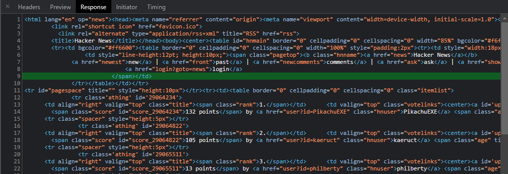

# HTML Elements & CSS Selectors
## Learning Objectives
* Explain the purpose of HTML
* Explain the structure of a HTML document
* Explain the formatting rules for HTML tags and properties
* Build well-formatted formatted HTML documents using the following tags: `div`, `p`, `h1`, `h2`, `h3`, `img`, `hr`, `ul`, `li`
* Understand the importance of code formatting and indentation

## HTML Tags
When we looked at the Request/Response cycle, we saw that the first request from a browser for a page returned a some text structured with angle brackets (`>` and `<`).



These are known as **tags**. These are part of a Markup language called **HTML** (Hyper Text Markup Language). It’s not a programming language, since we can’t describe logic with it. Instead, the **purpose of a markup language is to have a uniform notation that describes content and structure**.And that’s what HTML is for... to describe a page’s structure and content!

The basic building block of HTML is the tag. We’ve seen a few already in the examples before, but here we have them in its simplest form. 

```
<p>I'm a tag!</p>
```

This is an example of a **paragraph tag**, which we use in HTML to indetify paragraph of text in our document. We'll look at other types of tag later, but for now let's deconstruct this. Here we have the opening tag, which is just the the tag name wrapped in angled brackets

```
<p>
```

The we add the closing tag. The main difference is the forward slash (`/`), to tell us that this is the closing tag:

```
<p></p>
```

Then in between the tags we add the content belonging to this tag:

```
<p>I'm a tag!</p>
```

Remember that the purpose of tags is to describe the structure and form of the content. This means that its content doesn’t have to be only text!

Tags are meant to be used in pairs. But there are some specific ones that don’t have a closing counterpart. 

```
<br />
```

We can distinguish them by the forward slash before the last angled bracket, and they’re called self-closing tags:

### Tag Attributes

Some tags have additional text after the tag name:

```

```
These are called attributes. They will allow you to declare extra properties that belong to the tag. Attributes will either have a name followed by an = sign and a "string" with its value - or they will only have their name on its own that expresses that this attribute is enabled:

```
<p contenteditable>Hello</p>
```

The combination of the open and closing  tags, with its attributes, plus any content, forms what’s called an element.

### Nesting HTML
You can have elements inside of other elements as well! This is called nesting. This will allow you to group elements together in a meaningful way!

```
<div>
    <div>
        <div></div>
    </div>
</div>
```
### The Basic Elements
Now that we’ve seen what HTML markup looks like, let’s have a look at some of the most basic elements. Since originally HTML was created to model a real world written document, you’ll notice that some of these elements are familiar in name, and how they behave when your HTML page **renders**

#### Headings
```
<h1>Title</h1>
<h2>Title</h2>
<h3>Title</h3>
<h4>Title</h4>
<h5>Title</h5>
<h6>Title</h6>
```
These are heading elements, and they create a hierarchy for the titles in a page


## Teacher Demo
Your teacher will now demonstrate how to construct an HTML page that mimics the structure of a book using HTML tags.

## Student Practice
### Morning Exercises
* [Profile Page](https://github.com/boolean-uk/boolean-uk-html-profile)
    * `git@github.com:boolean-uk/boolean-uk-html-profile.git`

### Afternoon Exercises
* [Boolean News](https://github.com/boolean-uk/boolean-uk-html-boolean-news)
    * `git@github.com:boolean-uk/boolean-uk-html-boolean-news.git`
* [Scientific Paper](https://github.com/boolean-uk/boolean-uk-html-boolean-news)
    * `git@github.com:boolean-uk/boolean-uk-html-scientific-paper.git`