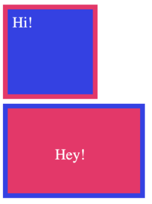

# Skills Workshop - CSS Box Model
## Learning Objectives
* Explain the difference between `block`, `inline` and `inline-box` types in CSS
* Explain how change a box's `type` with CSS
* Explain the purpose of `padding`, `border` and `margin`
* Explain how `padding`, `border` and `margin` contribute to the size of an element rendered by the browser.
* Explain how the `box-style` proprty affects the rendered size of a block element
* Use `padding`, `border` and `margin` to precisely layout CSS block elements

## Intro
Why do some HTML elements such as `h1` always display on a new ;line, but others like `span` don't? This is down to the CSS **box model** which we will explore in this session.

## Teacher Demo
Your teacher will demonstrate using CSS to style an HTML page:
* Show how elements like `h1` layout differently to elements like `span` and `strong`
* Show examples that  demonstrate the difference between `inline`,  `inline-block` and `block` elements
* Explain why the different types of model are needed when  styling an HTML page
* Show how to change a box's type with the `display` property
* Demonstrate use of `padding`, `margin` and `border`
* Demonstrate how to use the inspector to see how each of these elements make up a box's size
* Show how the `box-sizing` CSS rule effects the size of a box element

## Student Practice
Practice the skills the teacher has demonstrated by attempting to recreate the HTML page below as precisely as you can:

Use the provided reference material where required and ask in for help the #support channel if you need it.

## Reference Material
* [MDN CSS Box Model](https://developer.mozilla.org/en-US/docs/Learn/CSS/Building_blocks/The_box_model)
* [Boolean HTML & CSS  Slides](https://docs.google.com/presentation/d/172PBLG51fwFRL1ucKrsEQGaS_NeG-yX5FFiYIrSUI9A/edit#slide=id.gc15a2380c7_1_132)

## Group Discussion
At the end of the workshop, the teacher will call you back in to a group session with the rest of your cohort to discuss the exercise. 

## Follow-on Exercises
After the workshop, you will continue to practice using the below exercises.

***TODO***